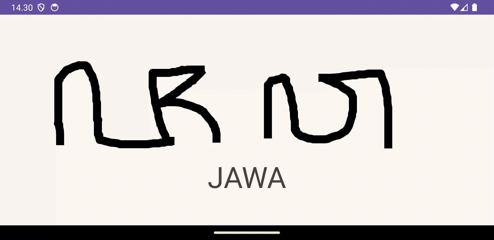
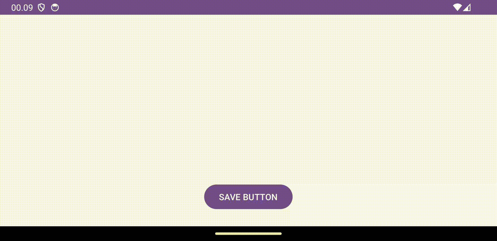

# Android with C++ and JNI: StrokeMatching Sample

In 2020 I with the team build Aksaraya. Aksaraya is Indonesian learning traditional script which is build on iOS. One of the feature is "Stroke Matching" which is similar to Duolingo Learning Japanese Character. In this repository contains a sample "Stroke Matching" that implements C++ with JNI.

# Video Demo

# How to make default strokes
-  uncomment related to button in "MainActivity" and "activty_main.xml"
-  comment at "PaintView" line 84 and lines 87-95 and "MainActivity" line 36
-  run project, make your own strokes and then save.
Dont forget to comment and uncomment above steps to use the "Stroke Matching" feature.

# Next Plan:
- Publish Medium Article for Android "Stroke Matching"
- iOS Tutorial "Stroke Matching"

# Aksaraya
https://apps.apple.com/id/app/aksaraya-aksara-jawa/id1536319329
